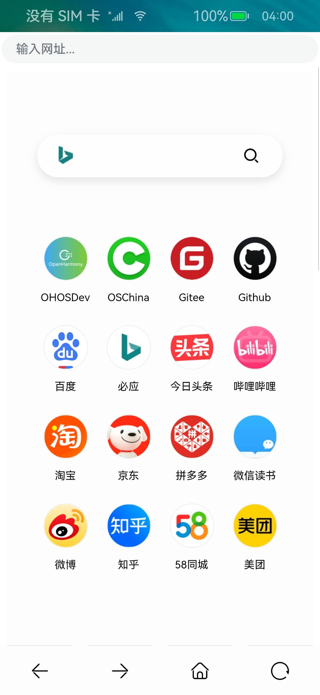

# BrowserCE

## 项目介绍

OpenHarmony 浏览器社区版，在原版Demo基础上做定制修改和优化

- 本项目是基于 OpenHarmony官方组织应用示例仓库中的 Browser 子项目进行二次开发的社区版本，同样为 Apache 2.0 许可  
- 原项目地址：https://gitee.com/openharmony/applications_app_samples/tree/weekly_20230314/code/BasicFeature/Web/Browser  
- 由于原仓库是所有示例应用的大合集，并不方便外部开发者单独fock进行衍生开发，这里单独拉取了Browser子项目的源代码  
- 原版在`weekly_20230321`分支配置从API9改成了API10，其他不变，暂时选择`weekly_20230314`分支基础上进行二开
- 即使用新版的代码，实际上替换9或者10的Full-SDK后，配置直接改成API9，依然是可以直接运行的
- 原始 [README.md](./README_zh.origin.md)

## 修改说明

> 后续修改说明将不在这里补充，具体请查看commit中的信息

- deviceType如果为default，默认也按phone处理
- 修复地址栏字体太大被遮挡
- 修复地址栏输入非https时无法跳转
- 多处https前缀追加移除，兼容http地址
- PhoneLayout图标和布局调整，一行显示更多

## 开发环境

> 如果没有Full-SDk，可以下载我编译好的：https://www.bilibili.com/opus/775167350060089384

- DevEco Studio 3.1 Beta1
- SDK API9 3.2.10.6 Beta5 伪装替换为 Full-SDK API10 4.0.5.3 Canary1

## 截图预览

## 视频演示

https://www.bilibili.com/video/BV1Xs4y1S7UW