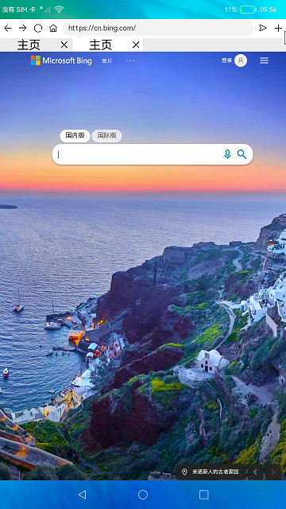

# 浏览器

### 介绍
本示例使用[@ohos.systemparameter](https://gitee.com/openharmony/docs/blob/master/zh-cn/application-dev/reference/apis/js-apis-system-parameter.md)接口和[Web组件](https://gitee.com/openharmony/docs/blob/master/zh-cn/application-dev/reference/arkui-ts/ts-basic-components-web.md)展示了一个浏览器的基本功能,展示网页，根据页面历史栈前进回退等。

### 效果预览

|首页|打开网址|
|----|------|
|||

使用说明:
1. 连接Wifi，启动应用，展示默认页面内容;
2. 点击默认页面的图标跳转到对应网页，或者在输入框输入网址，点击右侧跳转按钮跳转到对应网页;
3. 点击输入框左侧向右向左按钮进行页面的前进后退;
4. 点击主页图标回到主页，点击加号按钮新建一个页面。

### 工程目录
```
entry/src/main/ets/
|---Application
|   |---AbilityStage.ets                        // 入口
|---pages
|   |---Index.ets                               // 首页
|---common
|   |---PhoneLayout.ets                         // 窗口管理工具
|   |---TitleBar.ets                            // 导航栏
|---model
|   |---Logger.ts                               // 日志工具
|   |---Browser.ets                             // 浏览器实例
```

### 具体实现
+ Web展示与历史栈操作功能在Browser中，源码参考[Browser.ets](entry/src/main/ets/model/Browser.ets)
  + 加载网页及刷新：使用WebController提供的loadUrl可以加载目标网址内容，使用refresh方法刷新页面;
  + 页面前进后退功能：页面在前进或者后退前使用accessForward/accessBackward查询是否有历史记录,然后调用forward/backward进行前进/后退操作。

### 相关权限

[ohos.permission.INTERNET](https://gitee.com/openharmony/docs/blob/master/zh-cn/application-dev/security/permission-list.md#ohospermissioninternet)

[ohos.permission.GET_WIFI_INFO](https://gitee.com/openharmony/docs/blob/master/zh-cn/application-dev/security/permission-list.md#ohospermissionget_wifi_info)

###  约束与限制

1. 本示例仅支持标准系统上运行;
2. 本示例需外接鼠标进行验证;
3. 本示例不支持点击tab页签，切换网页并刷新页面;
4. 本示例涉及使用系统接口：[@ohos.systemparameter](https://gitee.com/openharmony/docs/blob/master/zh-cn/application-dev/reference/apis/js-apis-system-parameter.md)，需要手动替换Full SDK才能编译通过，具体操作可参考[替换指南](https://gitee.com/openharmony/docs/blob/master/zh-cn/application-dev/quick-start/full-sdk-switch-guide.md);
5. 本示例需要使用DevEco Studio 3.0 Beta4 (Build Version： 3.0.0.992， built on July 14， 2022)才可编译运行。

### 下载

如需单独下载本工程，执行如下命令：
```
git init
git config core.sparsecheckout true
echo code/BasicFeature/Web/Browser/ > .git/info/sparse-checkout
git remote add origin https://gitee.com/openharmony/applications_app_samples.git
git pull origin master
```